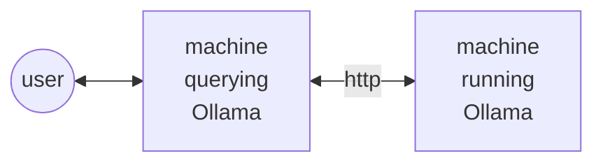

# Dirty RAG

## Description

Simple and stupid local agentic RAG chatbot in TypeScript

This relies on:
* ollama (backend)
* nodejs (script part)
  * vectra (json file system vector store)
  * tsx (typescript file executer)

## How To Install:

```bash
# here assuming ollama is installed
ollama serve # if not running
ollama pull nomic-embed-text:latest

ollama pull mistral:latest
# alternatively the model "llama3.1:8b" is also supported

# here assuming nodejs is installed
npm install
```

## How To Run:
```bash
npx tsx ./src/index.ts
```

----
----
----

## Extra: Using a remote machine to run Ollama:



#### Machine running Ollama

Run those 2 bash commands :

```bash
# allow more than just localhost clients
export OLLAMA_HOST=0.0.0.0
ollama serve
```

#### Machine querying Ollama

##### step1

Create a `.env` file containing this line
```bash
OLLAMA_URL=http://{THE_IP_OF_THE_REMOTE_MACHINE}:11434
```

##### step2

```bash
npx tsx ./src/index.ts
```
